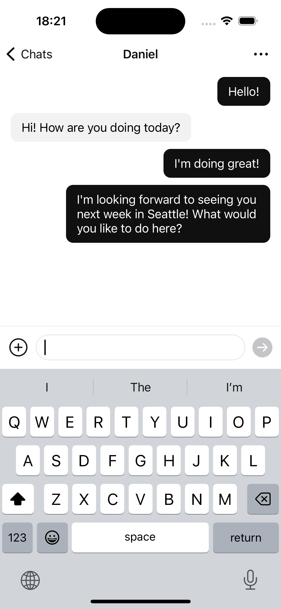

# iOS-Chat-App-Demo

This is an iOS chat app demo built with Swift using UIKit, in which all the UI components are built programmatically without using storyboards. Currently, it only contains the UI, and there is no communication with any API or server.

Some features in the UI are not finished yet, such as searching for chats and contacts.

## Running the App

After starting the app, click either "Sign Up" or "Log In", and then click the button in the next screen directly to enter the app. You don't need to enter any information in the textfields, although you may do so, which won't affect the sample data that will be created in the app.

## Screenshots

Here are some screenshots of the app.

    
    
    
    
	 
	
    
    

## Notice

This is for educational purposes only and should not be used for commercial purposes.

## License

This is licensed under the MIT license. See [LICENSE](./LICENSE) for more information.
